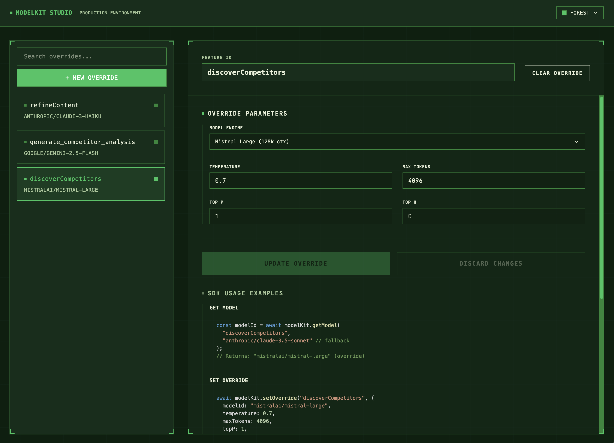

# ModelKit

Type-safe AI model configuration with zero-downtime runtime overrides.

Change models and parameters on the fly without redeploying your app.

## Features

- Type-safe with 340+ OpenRouter models
- Zero-downtime configuration updates
- Redis-backed persistence
- React UI for visual management
- In-memory caching for performance

## Packages

| Package                                       | Version                                                                                                                     | Description                                 |
| --------------------------------------------- | --------------------------------------------------------------------------------------------------------------------------- | ------------------------------------------- |
| [@benrobo/modelkit](./packages/sdk)           | [](https://www.npmjs.com/package/@benrobo/modelkit)               | Core SDK for model configuration management |
| [@benrobo/modelkit-studio](./packages/studio) | [](https://www.npmjs.com/package/@benrobo/modelkit-studio) | React UI for visual model management        |

## Studio

ModelKit Studio is a React UI that connects to **your existing backend**—the one where you’ve already configured the ModelKit SDK. You pass it the backend URL (e.g. your API base + the route where the ModelKit router is mounted), and Studio uses that to list overrides, set/clear them, and show live SDK examples.

**Supported backends:** only **Hono** and **Express** are supported for now (via `createModelKitHonoRouter` and `createModelKitExpressRouter`).



What you get:

- Switch models and parameters per feature without touching code
- See all active overrides and edit temperature, max tokens, top P/K in real time
- Non-engineers can manage model selection; useful for rollbacks and cost tuning

Install and mount the component (import the styles once so it renders correctly):

```bash
npm install @benrobo/modelkit-studio
# or: bun add @benrobo/modelkit-studio
```

```tsx
import { ModelKitStudio } from "@benrobo/modelkit-studio";
import "@benrobo/modelkit-studio/styles";

<ModelKitStudio apiUrl="http://localhost:3000/api/modelkit" theme="dark" />;
```

Use your real backend URL for `apiUrl` (e.g. `https://api.yourapp.com/api/modelkit` in production). See [packages/studio/README.md](./packages/studio/README.md) for themes and props.

## Quick Start

### Installation

```bash
npm install @benrobo/modelkit
# or: bun add @benrobo/modelkit
```

### Backend Setup

```typescript
import { Hono } from "hono";
import { createModelKit, createRedisAdapter } from "@benrobo/modelkit";
import { createModelKitHonoRouter } from "@benrobo/modelkit/hono";

const adapter = createRedisAdapter({
  url: process.env.REDIS_URL || "redis://localhost:6379",
});

const modelKit = createModelKit(adapter);

// Use in your app
const modelId = await modelKit.getModel(
  "chatbot",
  "anthropic/claude-3.5-sonnet"
);

// Expose REST API
const app = new Hono();
app.route("/api/modelkit", createModelKitHonoRouter(modelKit));
```

### Type Safety

Generate TypeScript types from your ModelKit API:

```bash
# Start your backend first, then generate types
npx modelkit-generate --api-url http://localhost:3000/api/modelkit
```

This creates `src/modelkit.generated.ts` with:

```typescript
export type FeatureId = "chatbot" | "content.generate" | "swot.analysis";

// ... plus dynamic usage examples with your actual features
```

**Use the generated types:**

```typescript
import type { FeatureId } from "./modelkit.generated";

const adapter = createRedisAdapter<FeatureId>({ url: "..." });
const modelKit = createModelKit<FeatureId>(adapter);

// ✅ TypeScript autocomplete works!
await modelKit.getModel("chatbot", "anthropic/claude-3.5-sonnet");

// ❌ Compile-time error for invalid feature IDs
await modelKit.getModel("invalid", "gpt-4");
```

### React UI (Studio)

Install [@benrobo/modelkit-studio](./packages/studio), then point it at your backend’s ModelKit API URL. See [Studio](#studio) for the screenshot, setup, and supported backends (Hono and Express).

## Use Cases

- A/B test different models without redeploying
- Switch to cheaper models for cost optimization
- Emergency fallback during model outages
- Adjust parameters (temperature, tokens) in production
- Different models per environment (dev/staging/prod)

## How It Works

```
getModel(featureId, fallbackModel)
  ↓
1. Check in-memory cache (60s TTL)
  ↓
2. Check Redis override
  ↓
3. Return fallbackModel
```

The fallback model ensures your app works even if Redis is down.

## SDK API

```typescript
await modelKit.getModel("feature-id", "anthropic/claude-3.5-sonnet");

await modelKit.setOverride("feature-id", {
  modelId: "anthropic/claude-opus-4",
  temperature: 0.9,
  maxTokens: 4096,
});

await modelKit.getConfig("feature-id");
await modelKit.listOverrides();
await modelKit.clearOverride("feature-id");
```

## REST API

Both `createModelKitHonoRouter()` (Hono) and `createModelKitExpressRouter()` (Express) expose:

- `GET /overrides` - List all overrides
- `GET /overrides/:featureId` - Get specific override
- `POST /overrides/:featureId` - Set override
- `DELETE /overrides/:featureId` - Clear override

## Custom Storage Adapter

```typescript
import type { StorageAdapter } from "@benrobo/modelkit";

function createMyAdapter(): StorageAdapter {
  return {
    async get(featureId) {
      /* ... */
    },
    async set(featureId, override) {
      /* ... */
    },
    async delete(featureId) {
      /* ... */
    },
    async list() {
      /* ... */
    },
  };
}

const modelKit = createModelKit(createMyAdapter());
```

## License

MIT
