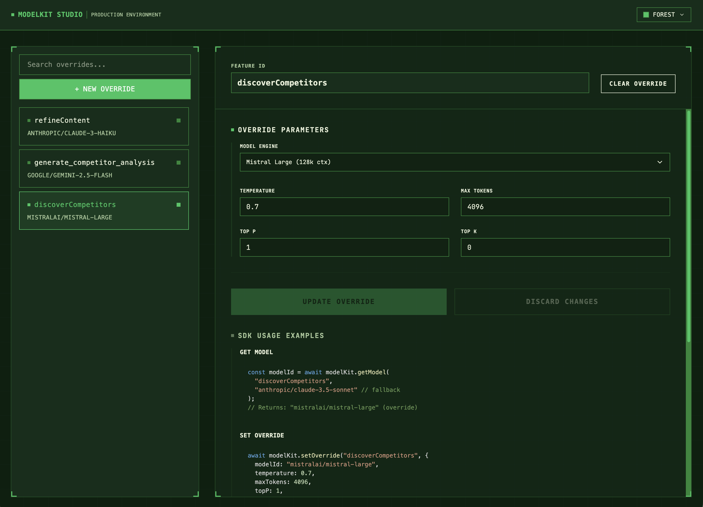

# ModelKit

Type-safe, runtime-overridable model configuration for apps that already call AI APIs (Vercel AI SDK, OpenRouter, etc.). You keep your API keys and inference; ModelKit supplies the model ID—and optional parameters—so you can change which model a feature uses without redeploying.

## Problems ModelKit solves

- **Model choice is fixed in code or config.** Changing which model a feature uses (for cost, quality, or an outage) usually means editing code or config and redeploying.
- **Only engineers can switch models.** Product or ops can't roll back or tune models without a deploy.
- **Feature and model IDs are untyped.** Typos and invalid model IDs show up at runtime instead of at build time.

ModelKit moves model selection to runtime: your app calls `getModel(featureId, fallback)`, gets the effective model ID (from overrides or fallback), and passes it to your existing SDK. Overrides are stored in Redis and editable via API or Studio—no redeploy required. Not a managed inference service.

## Features

- **Type-safe:** generated feature IDs and 340+ OpenRouter model IDs; invalid IDs fail at compile time
- **Runtime overrides:** change model and parameters per feature in production without redeploying
- **Redis-backed persistence** with in-memory caching (60s TTL)
- **Studio:** Visual override management UI — served automatically by the SDK router at `/studio`. Also embeddable as a React component.

## Packages

| Package                                       | Version                                                                                                                     | Description                                 |
| --------------------------------------------- | --------------------------------------------------------------------------------------------------------------------------- | ------------------------------------------- |
| [@benrobo/modelkit](./packages/sdk)           | [](https://www.npmjs.com/package/@benrobo/modelkit)               | Core SDK for model configuration management |
| [@benrobo/modelkit-studio](./packages/studio) | [](https://www.npmjs.com/package/@benrobo/modelkit-studio) | React component for embedding Studio in an existing app (optional) |

## Studio

Studio is a visual interface for your overrides: list, set, or clear them and view live SDK examples. It's responsive and works on desktop and mobile.



### Zero-install — served automatically by the SDK router

If you're already using the Hono or Express router, Studio is served at `/studio` with no extra config. No React install required in your app.

```typescript
import { Hono } from "hono";
import { createModelKit, createRedisAdapter } from "@benrobo/modelkit";
import { createModelKitHonoRouter } from "@benrobo/modelkit/hono";

const modelKit = createModelKit(
  createRedisAdapter({ url: process.env.REDIS_URL || "redis://localhost:6379" })
);

const app = new Hono();
app.route("/api/modelkit", createModelKitHonoRouter(modelKit));
// Studio → http://localhost:3000/api/modelkit/studio
```

To disable Studio or change its path:

```typescript
createModelKitHonoRouter(modelKit, { studio: false })          // disable
createModelKitHonoRouter(modelKit, { studioPath: "/admin/ui" }) // custom path
```

### React component embed (optional)

To embed Studio inside an existing React app, install the package and render the component:

```bash
npm install @benrobo/modelkit-studio
# or: bun add @benrobo/modelkit-studio
```

```tsx
import { ModelKitStudio } from "@benrobo/modelkit-studio";
import "@benrobo/modelkit-studio/styles";

<ModelKitStudio apiUrl="http://localhost:3000/api/modelkit" theme="dark" />;
```

Use your production backend URL for `apiUrl`. See [packages/studio/README.md](./packages/studio/README.md) for themes and props.

## Quick Start

### Installation

```bash
npm install @benrobo/modelkit
# or: bun add @benrobo/modelkit
```

### Backend Setup (Hono)

```typescript
import { Hono } from "hono";
import { createModelKit, createRedisAdapter } from "@benrobo/modelkit";
import { createModelKitHonoRouter } from "@benrobo/modelkit/hono";

const adapter = createRedisAdapter({
  url: process.env.REDIS_URL || "redis://localhost:6379",
});

const modelKit = createModelKit(adapter);

// Use in your app
const modelId = await modelKit.getModel("chatbot", "anthropic/claude-3.5-sonnet");

// Expose REST API + Studio
const app = new Hono();
app.route("/api/modelkit", createModelKitHonoRouter(modelKit));
// Studio → http://localhost:3000/api/modelkit/studio
```

### Backend Setup (Express)

```typescript
import express from "express";
import { createModelKit, createRedisAdapter } from "@benrobo/modelkit";
import { createModelKitExpressRouter } from "@benrobo/modelkit/express";

const app = express();
app.use(express.json());

const modelKit = createModelKit(
  createRedisAdapter({ url: process.env.REDIS_URL })
);

app.use("/api/modelkit", createModelKitExpressRouter(modelKit));
// Studio → http://localhost:3000/api/modelkit/studio
app.listen(3000);
```

### Type Safety

Generate TypeScript types from your ModelKit API:

```bash
# Start your backend first, then generate types
npx modelkit-generate --api-url http://localhost:3000/api/modelkit
```

This creates `src/modelkit.generated.ts` with:

```typescript
export type FeatureId = "chatbot" | "content.generate" | "swot.analysis";
```

**Use the generated types:**

```typescript
import type { FeatureId } from "./modelkit.generated";

const adapter = createRedisAdapter<FeatureId>({ url: "..." });
const modelKit = createModelKit<FeatureId>(adapter);

// ✅ TypeScript autocomplete works!
await modelKit.getModel("chatbot", "anthropic/claude-3.5-sonnet");

// ❌ Compile-time error for invalid feature IDs
await modelKit.getModel("invalid", "gpt-4");
```

## Examples

ModelKit returns a model ID string (e.g. `anthropic/claude-3.5-sonnet`). You pass it to your AI provider with your own API key. Inference and keys remain in your app.

### With Vercel AI SDK + OpenRouter

```bash
npm install ai @openrouter/ai-sdk-provider @benrobo/modelkit
```

```typescript
import { createOpenRouter } from "@openrouter/ai-sdk-provider";
import { streamText } from "ai";
import { createModelKit, createRedisAdapter } from "@benrobo/modelkit";

const modelKit = createModelKit(createRedisAdapter({ url: process.env.REDIS_URL }));

// In your route or handler: get the effective model ID, then stream with your key
const modelId = await modelKit.getModel("chatbot", "anthropic/claude-3.5-sonnet");

const openrouter = createOpenRouter({ apiKey: process.env.OPENROUTER_API_KEY });

const result = streamText({
  model: openrouter(modelId),
  messages: [{ role: "user", content: "Hello" }],
});
```

### With OpenRouter HTTP API

```typescript
const modelId = await modelKit.getModel("chatbot", "anthropic/claude-3.5-sonnet");

const res = await fetch("https://openrouter.ai/api/v1/chat/completions", {
  method: "POST",
  headers: {
    "Authorization": `Bearer ${process.env.OPENROUTER_API_KEY}`,
    "Content-Type": "application/json",
  },
  body: JSON.stringify({
    model: modelId,
    messages: [{ role: "user", content: "Hello" }],
  }),
});
```

Your API key and the request/response cycle stay in your server; ModelKit only determines which `model` value to send.

## Use cases

- A/B test models or switch to a cheaper model without redeploying
- Roll back or adjust parameters (temperature, tokens) in production
- Let product or ops change model selection for a feature via Studio
- Use a fallback model when Redis is unavailable (no code change)

## How it works

```
getModel(featureId, fallbackModel)
  → in-memory cache (60s TTL)
  → Redis override (if set)
  → fallbackModel
```

If Redis is unavailable, the fallback is used so the app continues to run.

## SDK API

```typescript
// getModel: returns the effective model ID (string). Use this when calling your AI provider.
const modelId = await modelKit.getModel("feature-id", "anthropic/claude-3.5-sonnet");

// setOverride: persist a runtime override (modelId required; temperature, maxTokens, topP, topK optional).
await modelKit.setOverride("feature-id", {
  modelId: "anthropic/claude-opus-4",
  temperature: 0.9,
  maxTokens: 4096,
});

// getConfig: returns the full override for a feature, or null. Use when you need params (e.g. temperature), not just the ID.
const config = await modelKit.getConfig("feature-id"); // { modelId, temperature?, maxTokens?, ... } | null

await modelKit.listOverrides();   // All overrides: [{ featureId, override }, ...]
await modelKit.clearOverride("feature-id");   // Remove override; getModel will return fallback
```

## REST API

Both `createModelKitHonoRouter()` and `createModelKitExpressRouter()` expose:

- `GET /overrides` - List all overrides
- `GET /overrides/:featureId` - Get specific override
- `POST /overrides/:featureId` - Set override
- `DELETE /overrides/:featureId` - Clear override
- `GET /studio` - Studio UI (auto-served; disable with `{ studio: false }`)

## Router Options

```typescript
createModelKitHonoRouter(modelKit, {
  studio?: boolean;             // Serve Studio UI. Default: true
  studioPath?: string;          // Studio path relative to mount point. Default: "/studio"
  cors?: boolean | CorsOptions; // CORS (Hono only)
});
```

### Protecting routes (auth)

The ModelKit router exposes write endpoints — anyone who can reach it can set or delete overrides and access Studio. Protect it by adding your own middleware on the mount path **before** the router.

```typescript
// Hono — add middleware on the same path before app.route()
app.use("/api/modelkit/*", async (c, next) => {
  if (c.req.header("Authorization") !== `Bearer ${process.env.MODELKIT_SECRET}`) {
    return c.json({ error: "Unauthorized" }, 401);
  }
  await next();
});

app.route("/api/modelkit", createModelKitHonoRouter(modelKit));
```

```typescript
// Express — pass middleware as a second argument to app.use()
const authGuard = (req, res, next) => {
  if (req.headers.authorization !== `Bearer ${process.env.MODELKIT_SECRET}`) {
    return res.status(401).json({ error: "Unauthorized" });
  }
  next();
};

app.use("/api/modelkit", authGuard, createModelKitExpressRouter(modelKit));
```

Any auth strategy works — JWT, session cookies, IP allowlist, etc.

## Custom Storage Adapter

```typescript
import type { StorageAdapter } from "@benrobo/modelkit";

function createMyAdapter(): StorageAdapter {
  return {
    async get(featureId) { /* ... */ },
    async set(featureId, override) { /* ... */ },
    async delete(featureId) { /* ... */ },
    async list() { /* ... */ },
  };
}

const modelKit = createModelKit(createMyAdapter());
```

## License

MIT
